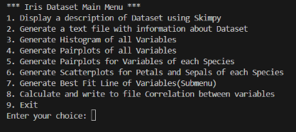
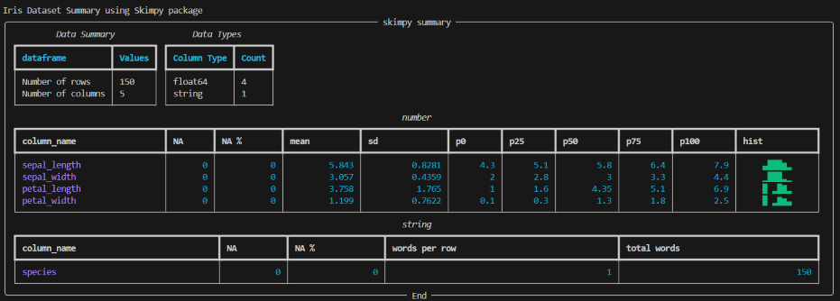
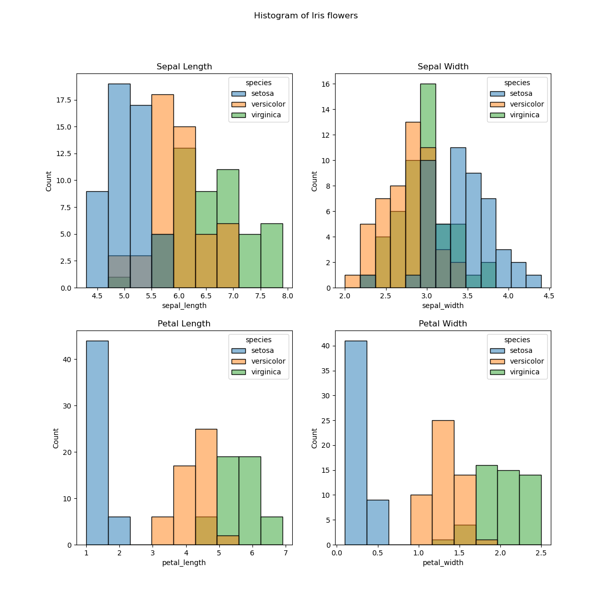
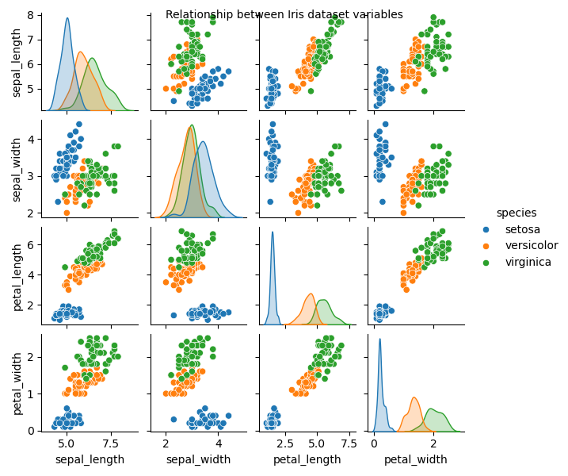
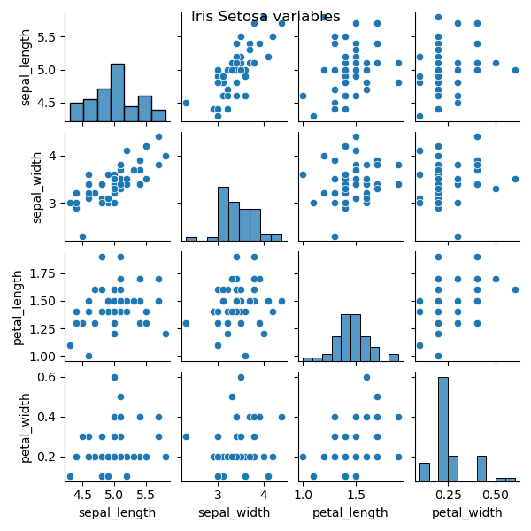
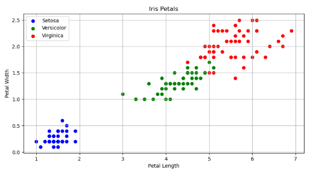
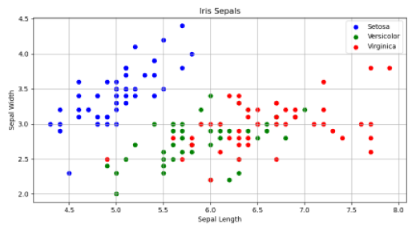
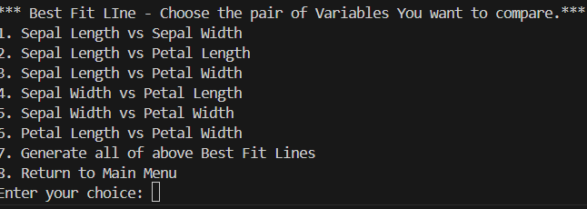

# Python and the Iris Dataset.

## Programming and Scripting - Project

#### by Ermelinda Qejvani

***
     

[Photo Source: Wikipedia](https://commons.wikimedia.org/wiki/File:Kosaciec_szczecinkowaty_Iris_setosa.jpg)

This README has been written with [GitHub's documentation on READMEs](https://docs.github.com/en/repositories/managing-your-repositorys-settings-and-features/customizing-your-repository/about-readmes) in mind.
You should refer to that documentation for more information on writing an appropriate README for visitors to your repository.
You can find out more about [writing in MarkDown in GitHub's documentation](https://docs.github.com/en/get-started/writing-on-github/getting-started-with-writing-and-formatting-on-github/basic-writing-and-formatting-syntax).

***
## About this repository

This git repository (pands-project) holds all the files of Programming and Scripting module project, as part of my [Hdip in Computer Science in Data Analytics](https://www.gmit.ie/higher-diploma-in-science-in-computing-in-data-analytics#:~:text=You%20are%20a%20Level%208,topics%20in%20your%20original%20degree.) in [ATU](https://www.gmit.ie/).

_Files and Folders in this repository:_

_Files:_

- `analysis.py` - main file to run the program.
- `analysisFunctions.py` - storing the following functions:
    - `create_empty_file`: creates analysis.txt file.
    - `create_iris_histograms`: generates VariablesHistogram.png to folder IrisGraphs.
    - `species_pairplot_to_folder`: generates pairplot graph of relations between variables in a given iris flower, e.g. IrisSetosaVariables.png
    - `save_iris_pairplot`: generates a pairplot graph of all variables in the DataFrame.
    - `plot_iris_petal_or_sepal`: generates a pairplot graph of variables for just petals or sepals.
- `bestFitLineMenu.py`:
    - creates a submenu to get users input of which variables to calculate/display graph of Best Fit Line.
    - function `best_fit_line` that plots the graph of input variables and adds the best fit line.
- `correlation.py` - holds two functions:
    - `calculate_correlation`: calculates the correlation between the variable values of the dataset.
    - `write_correlation_to_file`: creates and stores a list of tuples, output from calculate_correlation, sorts it, and writes the output in `correlation_results.txt`.
- `analysis.txt` - a text file created when the program starts.
- `correlation_results.txt` - generated by correlation.py file.
- `iris.scv` - downloaded from [Michael Waskom on GitHub](https://raw.githubusercontent.com/mwaskom/seaborn-data/master/iris.csv).
- a `.gitignore` file.
- This `README` file.

_Folders:_

- `IrisGraphs` - holds 7 .png file generated from the program (when all options of program are run).
    - `BestFitLine` - a subfolder where 6 .png files of graphs of plots with a best fit line are stored.
- `images` - holds three .jpg files of iris species analyzed in this project.

***
## About this project

This project is a study about Iris flower data set, or Fisher's Iris data set - a collection of measurements taken from three species of Iris flowers. Ronald Fisher, a British statistician and biologist, introduced this data set in 1936 to demonstrate linear discriminant analysis. Edgar Anderson collected the data to study the morphological differences among three Iris species: Iris Setosa, Iris Versicolor and Iris Virginica. Each species has 50 samples, and four measurements—sepal length, sepal width, petal length, and petal width—were recorded for each sample. Fisher used these measurements to create a model that can distinguish between the different Iris species. His work was published in the _Annals of Eugenics_, now known as the _Annals of Human Genetics_. [Source: Wikipedia](https://en.wikipedia.org/wiki/Iris_flower_data_set)

***
## Use of this project

The aim of this project is to develop a Python program that demonstrates various techniques for exploring, modifying, and analyzing data from the Iris dataset.

***
## Get Started

To run the files stored in this repository you will need to download and install in your computer the following apps:

- [Anaconda](https://www.anaconda.com/) - open-source platform that allows you to write and execute code in Python. A guide how to install Anaconda in your computer can be found [here](https://docs.anaconda.com/free/anaconda/install/index.html).
- [Visual Studio Code](https://code.visualstudio.com/) - source code editor for developers. With Visual Studio Code you can open and run all python files(ending with .py). A guide how to install and setup Visual Studio Code in your computer can be found [here](https://code.visualstudio.com/learn/get-started/basics).
- [Git](https://git-scm.com/downloads) - will help you to download a copy of this repository in your local machine. Installation guide can be found [here](https://github.com/git-guides/install-git).

To make a copy of this repository in your computer/local machine run the following command:

```
git clone https://github.com/ermelinda-q/pands-project.git
```
***
## Python program description

I created this program to show fifth-year computer science class at our school how Python can analyze data from .csv files. 

The Python libraries I used in this program are:
- `import pandas as pd`                       # Data Frame.
- `import numpy as np`                        # Numerical arrays.
- `import matplotlib.pyplot as plt`           # Plotting.
- `import seaborn as sns`                     # Subplotting.
- `from skimpy import skim`                   # Generating quick summaries.
- `from scipy.stats import pearsonr`          # Pearson's correlation coefficient.
- `from analysisFunctions import *`           # Functions created to use running this program.
- `from bestFitLineMenu import *`             # Best Fit Line function and submenu.   
- `from correlation import *`                 # Correlation function and submenu.
- `import os`                                 # Working with file and folder paths.
- `import warnings`                           # importing warning to deal with warning messages.

To make it easier to understand, I added a menu so users can easily navigate and learn how everything works.

- 
    

**Menu Choices**

1. Display a description of Dataset using Skimpy.

    The ouput of command skim(df) gives a detailed summary of dataset and the format is very easy to read and understand:

    

    - As you can see from the above output the dataset has:
        - 150 rows and 5 columns.
        - 4 of columns are float64(numerical values holding variables' data) and one string(holding species name).
        - The column names(variable names) numerical and string are displayed in different tables.
        - There are no null values(empty fields) in this dataset.
        - From the numerical data we can find the mean, standard deviation(std), minimum and maximum values and also percentiles (under 25%, 50%, 75%)
        - It is also displayed a small histogram of variables.

    Exploring this table will help us to decide what commands we can use for the next choice.

2. Generate a text file with about Dataset.

    This choice generates a text file named analysis.txt which gives first some basic information about the dataset and its variables and holds information generated by different python functions. Each output has information about the function used. To open the file follow this link [analysis.txt](./analysis.txt).

3. Generate a histogram of all variables.

    Choosing this option a histogram of all numerical variables is created and saved in ./IrisGraphs/VariablesHistogram.png.
    In this histogram each of species is differentiated by assigning a different colour using 'hue='species' parameter in the function created.

    

4. Generate Pairplots of all Variables.

    Another useful option in Python which provides a quick visual overview of relationship of variables in our dataset. In this way we can easily identify patterns of correlation if present. 

    .

5. Generate Pairplots for Variables of each Species.

    This option calls another function that generates a pairplot graph of variables, but this time in the function the species name is given as a parameter. This is a way to show that we can further explore the dataset by giving specific instructions to get a better understanding of its data.
    
    One of graphs generated:

    .

6. Generate Scatterplots for Petals and Sepals of each species.

    This options calls a function that generates a pairplot graph of variables belonging to the same part of the flower, petals (width v length) and sepals(width v length). A different colour is assigned for each of species making it easer to read and see if there is connection between the variables compared.

    . 

    As we can see from the above graphs the is a stronger correlation between petal length and petal width, comparing to a weaker correlation between sepal length and sepal width.

7. Generate Best Fit Line of Variables - Submenu.

    With this option I wanted to show that using Python we can create more complex programs where a menu option can call another function which will show us another menu. This option creates also another subfolder inside the IrisGraph folder called BestFitLine. All graphs generated from this submenu will be stored there(BestFitLine folder).

    .

    As you can see the user is presented with a menu to choose which variables they want to plot in a graph with added best fit line. For each given option a graph with the best fit line is saved in BestFitLine directory.

    An example of graph plots with the best fit line:

    .

8. Calculate and write to file Correlation between variables.

    This option calls functions from correlation.py file. One calculates correlation(calculate_correlation) of two values and the other one(write_correlation_to_file) creates sets of two variables, the numerical ones, and stores them in a list named correlation_results. This second function(write_correlation_to_file) calls calculate_correlation function, stores all data and sorts it from the strongest to the weakest one. Information about correlation and all values generated from functions are stored in [correlation_results.txt](./correlation_results.txt).

9. Exit the program.

    This option breaks the loop in main menu and ends the program.

***
## References:

- [Sorting Arrays in Python](https://jakevdp.github.io/PythonDataScienceHandbook/02.08-sorting.html).
- [Plotting with matplot library](https://jakevdp.github.io/PythonDataScienceHandbook/04.00-introduction-to-matplotlib.html).
- [Saving figures to file](https://matplotlib.org/stable/api/_as_gen/matplotlib.pyplot.savefig.html).
- [Intro to matplotlib](https://jakevdp.github.io/PythonDataScienceHandbook/04.00-introduction-to-matplotlib.html).
- [Scatter plots](https://jakevdp.github.io/PythonDataScienceHandbook/04.02-simple-scatter-plots.html).
- [Histograms](https://jakevdp.github.io/PythonDataScienceHandbook/04.05-histograms-and-binnings.html).
- [Seaborn](https://jakevdp.github.io/PythonDataScienceHandbook/04.14-visualization-with-seaborn.html).
- [Machine Learning](https://jakevdp.github.io/PythonDataScienceHandbook/05.01-what-is-machine-learning.html).
